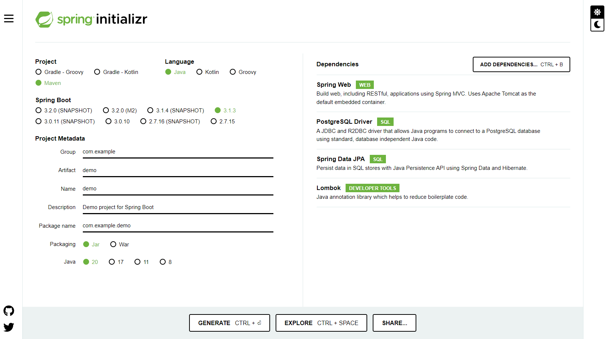

## API para Notificar Usando o E-Carta

Dividimos a aplicação, da missão de certificação do mundo 3, em aplicações menores e essa aplicação executa os seguintes procedimentos:

- Disponibiliza os processos que serão notificados através do E-Carta pelo método GET de uma API REST.
- Serão disponibilizados no mínimo 10 processos para o envio. 
- Usaremos o método PUT para atualizar as cartas que foram notificadas. 
- Será consultada a API ViaCEP para atualizar as informações de endereço das partes no banco através do CEP.

Para iniciar este projeto, foi utilizado o [spring initializr](https://start.spring.io/) utilizando as seguintes opções:

Para iniciar este projeto, foi utilizado o [spring initializr](https://start.spring.io/) utilizando as opções:
* Project: Maven Project;
* Language: Java 11;
* Spring Boot: 2.6.0;
* Dependencies: Spring Web, Spring Data JPA, H2 Database e OpenFeign.

Dependência adicionada manualmente no `pom.xml`: [Springdoc OpenAPI UI v1.5.12](https://mvnrepository.com/artifact/org.springdoc/springdoc-openapi-ui/1.5.12).

essa API faz a notificação através do E-Carta disponibilizando os processos que serão notificados atra

Esta API faz parte do projeto da missão 3 e visa efetuar a disponibilização dos processos que irão ser enotificados usando

projeto tem o objetivo de trabalhar com conceitos de design e arquitetura de software, análise e levantamento de requisitos, tratamento de exceções e erros, criação de webservice e integração entre aplicações/API’s distintas, realização de transação com Sistema Gerenciador de Banco de Dados (SGBD), trabalhar com versionamento e desenvolver solução jurídica para um cenário real de necessidade do judicial nacional.

## Recursos

- Linguagem de programação Java LTS (JDK 17); 
- Builder através do Maven; 
- Banco de Dados Open Source PostgreSQL; 
- Versionado através do Git / Github; 
- Diagramação UML

**EQUIPE DEV TEAM 01**\
**Nome:** Jamison Queiroz - 202208101127@alunos.estacio.br\
**Nome:** Dayana Alves - 202205116484@alunos.estacio.br\
**Nome:** Herval Dantas - 202205119203@alunos.estacio.br\
**Nome:** Jonathan Araújo - 202205178111@alunos.estacio.br\
**Nome:** Leonardo Mota - 202205090981@alunos.estacio.br\
**Nome:** Rickson Viana - 202205071601@alunos.estacio.br\
**Curso:** Desenvolvimento Full Stack\
**Turma:** 2022.4\
**Professor:** André Luiz Avelino Sobral\
**Disciplina:** Projeto Back End com Banco de Dados e Conceitos de Engenharia de Software

