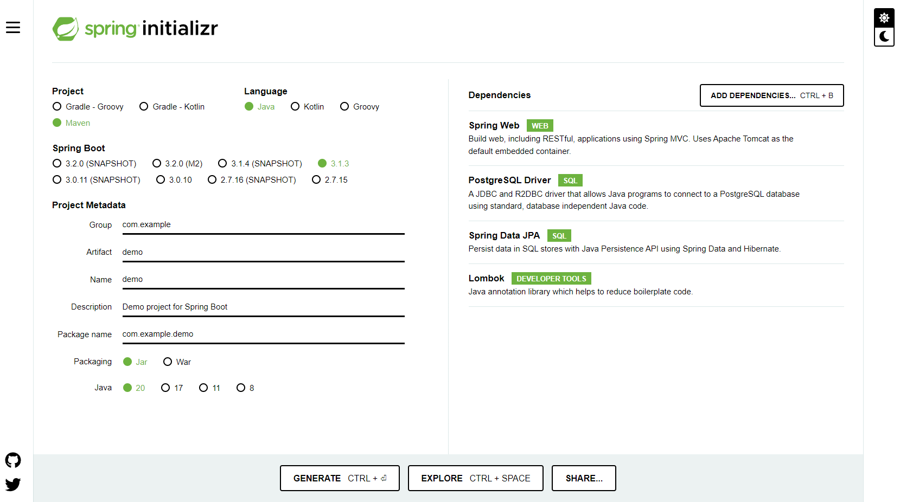
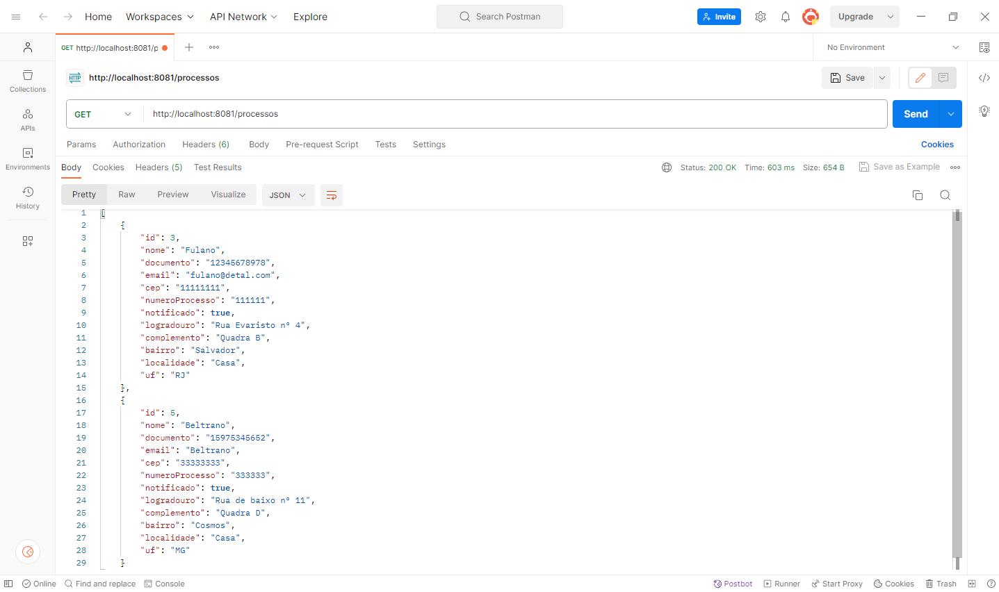
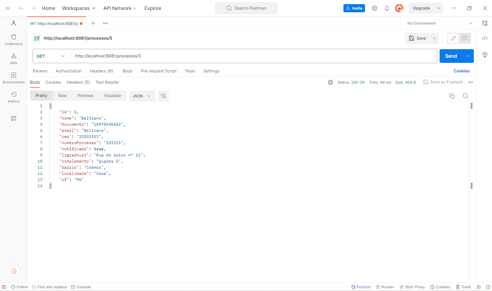

## API para Disponbilizar os Processos notificados

Dividimos a aplicação, da missão de certificação do mundo 3, em aplicações menores e essa aplicação executa os seguintes procedimentos:

- Disponibiliza os processos que foram notificados com êxito para o PJe;
- O método GET retorna somente os processos indicados como "true" na coluna "notificado" do banco de dados; 
- Ao utilizar o GET/id obtém-se somente o processo com o id indicado, pondendo ser consultado se a notificação obteve êxito no valor de "notificado" ;

<hr>

Para iniciar este projeto, foi utilizado o [spring initializr](https://start.spring.io/) utilizando as seguintes opções:



<hr>

Foi utilizado também os seguintes recursos:
* NetBeans IDE 18;
* JDK 20;
* PostgreSQL 15.4;

<hr>

Foi utilizado os seguintes Endpoints:

```
GET - processos/processos
GET - processos/processos/id
```
<hr>

Utilização do método GET



<hr>

Utilização do método GET/Id



<hr>
