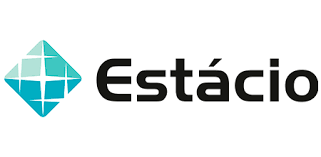

**EQUIPE DEV TEAM 01**\
**Nome:** Jamison Queiroz - 202208101127@alunos.estacio.br\
**Nome:** Dayana Alves - 202205116484@alunos.estacio.br\
**Nome:** Herval Dantas - 202205119203@alunos.estacio.br\
**Nome:** Jonathan Araújo - 202205178111@alunos.estacio.br\
**Nome:** Leonardo Mota - 202205090981@alunos.estacio.br\
**Nome:** Rickson Viana - 202205071601@alunos.estacio.br\
**Nome:** Cleyton Muto (Colaborador)\
**Curso:** Desenvolvimento Full Stack\
**Turma:** 2022.4\
**Professor:** André Luiz Avelino Sobral\
**Disciplina:** Projeto Back End com Banco de Dados e Conceitos de Engenharia de Software

## Missão Certificação Mundo 3

Este projeto tem o objetivo de trabalhar com conceitos de design e arquitetura de software, análise e levantamento de requisitos, tratamento de exceções e erros, criação de webservice e integração entre aplicações/API’s distintas, realização de transação com Sistema Gerenciador de Banco de Dados (SGBD), trabalhar com versionamento e desenvolver solução jurídica para um cenário real de necessidade do judicial nacional.

## Recursos

- Linguagem de programação Java; 
- Builder através do Maven; 
- Banco de Dados Open Source PostgreSQL; 
- Versionado através do Git / Github; 
- Diagramação UML

## Orientação

* O arquivo **mission3.sql** contém uma cópia do banco utilizado.
* Diretório **App** aplicação que disponibiliza as informações do PJE através de uma API SOAP.
* Diretório **ProcessNotifyApp** aplicação que notifica por e-mail e disponibiliza as informações através de uma API REST.
* Diretório **ApiNotificarCarta** aplicação que notifica por carta através de uma API REST.
* Diretório **Documentos** contém a documentação do projeto.
